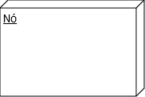

# Diagrama de Implantação

## Introdução

O diagrama de implantação é uma ferramenta essencial para visualizar a estrutura física do sistema Tsírko. Esta representação gráfica ilustra como os componentes de software são distribuídos em hardware real, fornecendo uma visão clara da infraestrutura necessária para suportar a aplicação, as conexões e dependências entre seus diversos elementos, permitindo compreender como será efetivamente implantado em um ambiente de produção.

## Metodologia

Para elaborar os diagramas de implantação do sistema Tsírko, nós, [Carlos](https://github.com/TheCarlosRamos), [Henrique](https://github.com/HeBatalha), [Isaque](https://github.com/IsaqueSH) e [Vinicius](https://github.com/vini051), utilizamos a ferramenta draw.io para mapear os componentes físicos e lógicos do sistema, incluindo servidores, dispositivos de acesso e serviços externos. Identificamos as conexões e protocolos de comunicação entre os diferentes nós, estabelecendo a infraestrutura necessária.

## Diagramas de Implantação

### Legenda

 <strong>Tabela 1:</strong> Legenda do Diagrama de Implantação  

|                                Elemento                                |   Nome   | Função                                                                                                                 |
| :--------------------------------------------------------------------: | :------: | :--------------------------------------------------------------------------------------------------------------------- |
|  | Artefato | Representa um elemento físico concreto no sistema, como arquivos, documentos, tabelas de banco de dados ou executáveis |
|    | Relação  | Representa a conexão e dependência entre componentes, indicada por linhas e setas.                                     |
|      |  Módulo  | Unidade de software com função específica, representado por retângulos com o estereótipo "<<component>>"               |
|              |    Nó    | Representa uma unidade física ou de execução onde os componentes são implantados                                       |

---

<b>Figura 1:</b> Diagrama de Implantação - Carlos 

<b>Autor:</b> <a href="https://github.com/TheCarlosRamos">Carlos Gabriel</a>, 2024.

---

<b>Figura 2:</b>  Diagrama de Implantação - Henrique 

<b>Autor:</b> <a href="https://github.com/HeBatalha">Henrique Azevedo</a>, 2024.

---

<b>Figura 3:</b>  Diagrama de Implantação - Isaque 

<b>Autor:</b> <a href="https://github.com/IsaqueSH">Isaque Santos</a>, 2024.

---

<b>Figura 3:</b>  Diagrama de Implantação - Vinicius 

<b>Autor:</b> <a href="https://github.com/vini051">Vinicius Brito</a>, 2024.

---

## Análise e Resultado

A análise dos diagramas de implantação apresentados revela a infraestrutura física e lógica do sistema Tsírko, demonstrando como os diferentes componentes de software são distribuídos em ambientes de hardware.

Diagrama de Implantação - [Carlos](https://github.com/TheCarlosRamos):
Mostra uma arquitetura sofisticada com proxy contendo load balancer, cache e firewall. O servidor de aplicação utiliza Node.js, e há conexões com diversos serviços externos via API REST, incluindo banco de dados MySQL, serviço de pagamento, API de geolocalização e serviço de notificações com Twilio/Firebase. Esta análise demonstra uma arquitetura bem estruturada, com foco em segurança, escalabilidade e integração de serviços.

Diagrama de Implantação - [Henrique](https://github.com/HeBatalha):
O diagrama apresenta uma estrutura completa com dispositivo de acesso via browser, web server com React e componentes Node.js. Inclui serviços especializados como mapa e pagamento, além de um data server com SGBD e blocos específicos para diferentes tipos de dados, incluindo uma wiki colaborativa.

Diagrama de Implantação - [Isaque](https://github.com/IsaqueSH):
Demonstra uma arquitetura com ênfase em segurança, incluindo firewall e separação clara entre ambiente cliente e servidor. O servidor web utiliza Apache, e a comunicação com o banco de dados MySQL é feita via TCP/IP, garantindo uma estrutura segura e organizada.

Diagrama de Implantação - [Vinicius](https://github.com/vini051):
Apresenta uma arquitetura dividida em três zonas principais: cliente (com PC e dispositivo móvel), servidor (com servidores web e de aplicação) e serviços externos. Inclui integrações com banco de dados, API de mapa, processador de pagamento e servidor de email, utilizando protocolos específicos como HTTPS e SMTP.

## Histórico de Versão

| Versão | Data       | Descrição                   | Autor                                                                                                                                                                      | Revisor                                              |
| ------ | ---------- | --------------------------- | -------------------------------------------------------------------------------------------------------------------------------------------------------------------------- | ---------------------------------------------------- |
| 2.0    | 28/11/2024 | Diagramas individuais                 | [Carlos](https://github.com/TheCarlosRamos), [Henrique](https://github.com/HeBatalha), [Isaque](https://github.com/IsaqueSH), [Vinicius Brito](https://github.com/vini051) | [Yves](https://github.com/yvestxt)                   |
| 1.0    | 28/11/2024 | Primeira versão do artefato | [Vinicius Brito](https://github.com/vini051)                                                                                                                               | [João](https://github.com/joaopedrodasilvarodrigues) |
